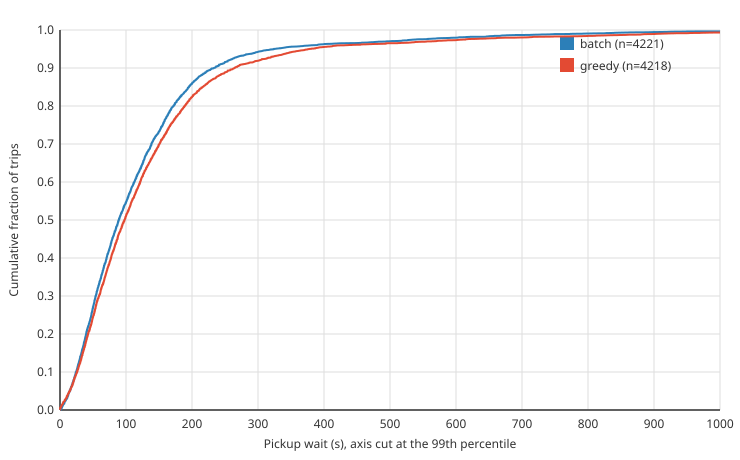

# MetroSim

[](https://github.com/Deathslayer89/MetroSim/actions/workflows/ci.yml)

A ride-hailing dispatch simulator running on San Francisco's road network. I wanted to know whether holding requests for a few seconds and solving the assignment for the whole batch beats handing each request to the nearest free driver, on a real street grid rather than a toy one. MetroSim runs both policies against identical, seeded demand and compares how long riders wait for pickup.

On the downtown scenario, batch matching cuts the mean wait by 14 seconds:



| policy | trips completed | mean wait | p50 | p95 |
|---|---:|---:|---:|---:|
| greedy | 4,218 (99.0%) | 139 s | 98 s | 378 s |
| batch, 3 s window | 4,221 (99.1%) | 124 s | 89 s | 324 s |

That's ten seeds per policy, one simulated hour each: 180 cars, about 430 requests in the hour, pickups concentrated in the Financial District, SoMa, the Mission and the Marina. A seed gives both policies exactly the same riders, so the comparison is paired. Batch had the lower mean wait in 10 of 10 seeds, and the mean per-seed difference is -14.4 s with a 95% bootstrap interval of -16.2 to -12.8 s. The full report, with the command and commit that produced it, is [experiments/headline/report.md](experiments/headline/report.md).

```bash
make fetch-osm    # ~30 MB San Francisco extract from bbbike.org
make experiment   # 20 one-hour runs; about 6 minutes on 20 cores
```

## How it works

The map is an OpenStreetMap extract of San Francisco and the north end of the peninsula: drivable roads only, one-way rules applied, speeds from `maxspeed` or a default for the road class. Raw extracts are full of dead ends and one-way traps at the edges, so the loader keeps only the largest strongly connected component. That leaves 240,128 nodes and 440,814 edges, and every node can reach every other.

Routing is A* on travel time with a weighted heuristic: straight-line distance over the fastest speed limit in the graph, which never overestimates, multiplied by 3. The weight caps any route at 3x optimal and cuts the search a lot. Over 100 random pairs, routes come out 11% above optimal on average and the p95 search takes 19 ms, against 137 ms for plain admissible A* (`go test -v -run RouteQuality ./internal/osm`). Using distance in meters as the heuristic, a common shortcut, behaves like a weight of about 29 and gives routes 70% slower than optimal.

Each edge's travel time follows a BPR curve on the number of cars on it. Cars move against those times and replan, at most once a simulated second, when an edge still ahead of them changes by more than 10%.

Idle drivers live in an H3 index at resolution 9. Greedy takes requests in arrival order and gives each one the nearest driver that can reach it. Batch waits out a 3-second window, routes every pending request to its five nearest idle drivers, and solves the assignment with the Hungarian algorithm, which I wrote and test against brute force. A region-sharded variant solves each H3 resolution-5 region on its own.

Demand comes from scenario files: a piecewise-linear arrival rate, Poisson arrivals, and hotspots that each take a stated share of pickups or dropoffs. The seed fixes everything, so two runs with the same seed produce identical trips, and a test checks exactly that.

Every request, match, pickup, dropoff, driver position and surge change is a proto3 event. Inside one process they go over a synchronous in-memory bus. With `--bus=kafka` they go to Kafka instead, where three services pick them up:

- `trace-writer` turns each consumed batch into its own Parquet file and commits offsets only once the file is complete. If it dies mid-batch, Kafka redelivers and the trips already on disk are skipped.
- `metrics-aggregator` serves Prometheus metrics. Run two and they split the partitions; Prometheus adds them up.
- `live-view` rebuilds positions, surge and trip counts from the events and pushes them to the browser.

Smaller pieces: surge per H3 resolution-8 cell (open requests over idle drivers, clamped to 1x to 3x, smoothed over 60 s), optional driver declines and cancellations, riders who give up after `--max-wait`, a Grafana dashboard definition, and a ridge-regression ETA model. The ETA model is a baseline. Trained on 2,000 routed pairs it predicts free-flow trip time with an in-sample R² of 0.89, nearly all of it from distance. Surge and the ETA model can both feed into batch matching (`--surge-premium`, `--eta-weight`); both are off by default and off in the headline.

## Running it

```bash
make demo    # both policies on a 10-node test grid, about a second
```

The live map needs the extract:

```bash
make fetch-osm
go run ./cmd/metrosim --osm data/osm/city.osm.pbf --scenario scenarios/morning_rush.yaml --policy batch
# then open http://localhost:8080
```

The page shows cars by state (idle, heading to a pickup, carrying a rider), congested edges, idle-driver and surge cells, and pause, stop and speed controls. `--max-wait 5m` makes riders give up, `--driver-accept-rate` and `--driver-cancel-rate` add driver friction, and `--speed` runs the clock faster.

The scenarios:

- `downtown` is the headline.
- `morning_rush` has pickups in residential neighborhoods, dropoffs downtown, and a peak that outruns its 150 cars.
- `airport_surge` sends late arrivals from SFO into the city, far more than 80 cars can carry.
- `baseline` and `balanced_demo` spread demand evenly over the whole map.
- `smoke` runs on the test grid for `make demo`.

The Kafka setup runs in Docker:

```bash
make stack-up    # Kafka, trace-writer, two metrics-aggregators, live-view
go run ./cmd/metrosim --bus=kafka --osm data/osm/city.osm.pbf --scenario scenarios/downtown.yaml
# live map on :8080, trip metrics on :9101 and :9102, fleet gauges on :9100, Parquet in traces/
```

Prometheus and Grafana aren't in the compose file; scrape those ports and import `dashboards/marketplace_health.json`.

`make cluster-up` starts a three-broker version (replication factor 3, at least 2 in-sync replicas), where stopping one broker doesn't stop writes. `cmd/replay` moves a consumer group back to an earlier offset, for example to rebuild `traces/` from the log.

Traces load straight into DuckDB:

```bash
duckdb -c "SELECT policy, count(*), avg(wait_time_s), quantile_cont(wait_time_s, 0.95)
           FROM 'traces/*.parquet' GROUP BY policy"
```

## Layout

```
cmd/metrosim            the simulator; serves the map itself unless --bus=kafka
cmd/experiment          headless A/B runs and the report
cmd/trace-writer        Kafka to Parquet
cmd/metrics-aggregator  Kafka to Prometheus
cmd/live-view           Kafka to the browser
cmd/replay              rewinds a consumer group
cmd/train-eta           fits the ETA model
internal/               osm, graph, pathfinding, traffic, agent, dispatcher, scenario,
                        simulation, events, surge, eta, stats, tracelog, and the servers
proto/events            event schema
web/static              the map page
scenarios/              scenario files
deploy/                 Dockerfile and compose files
dashboards/             Grafana dashboard
experiments/headline/   the run behind the numbers above
```

## Limitations

- The comparison covers matching and nothing else. Idle cars stay where they dropped someone off. There's no repositioning, riders don't react to prices, and drivers have no preferences.
- Congestion uses a steeper curve than textbook BPR: alpha 1 and beta 2 instead of 0.15 and 4, capped at 5x. With a few hundred cars the textbook curve barely moves, so this one exaggerates congestion to make it matter.
- Waits are measured on completed trips. Both policies complete 99% or more of requests in the headline, so little is left out.
- Routes are within 3x optimal by construction. In the 100-pair test the worst one took 54% longer than the best path.
- Region sharding runs in one process. Splitting it across processes needs a way to hand off drivers near region boundaries, and that isn't written.
- `live-view` rebuilds its whole snapshot ten times a second and sends it to every client, which won't hold up for a fleet in the tens of thousands.
- Trace dedup remembers the last 100,000 trips. A trip redelivered after it has aged out gets written twice.

## License

MIT, see [LICENSE](LICENSE).
