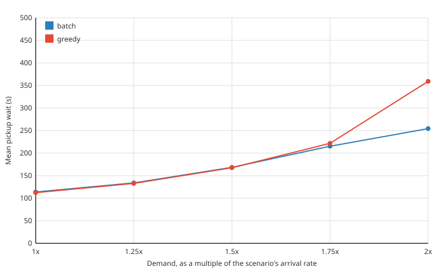
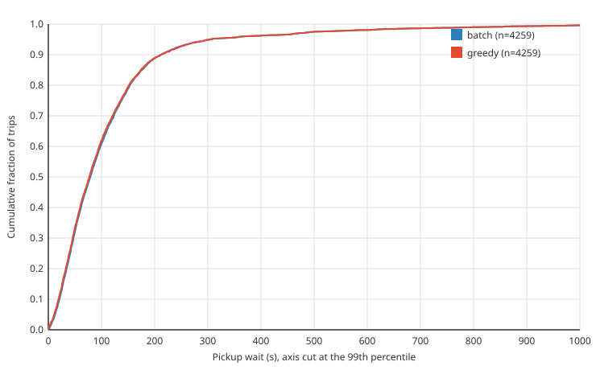
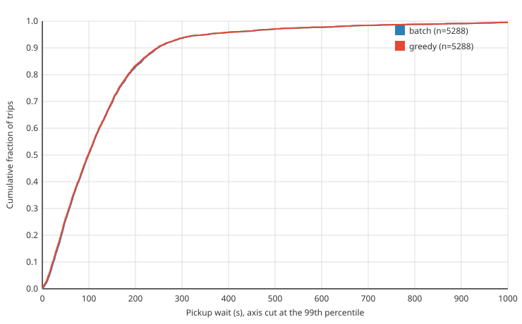
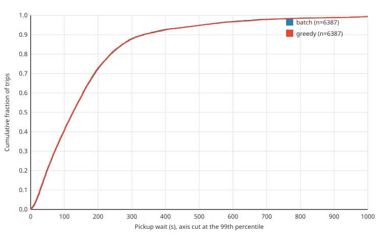
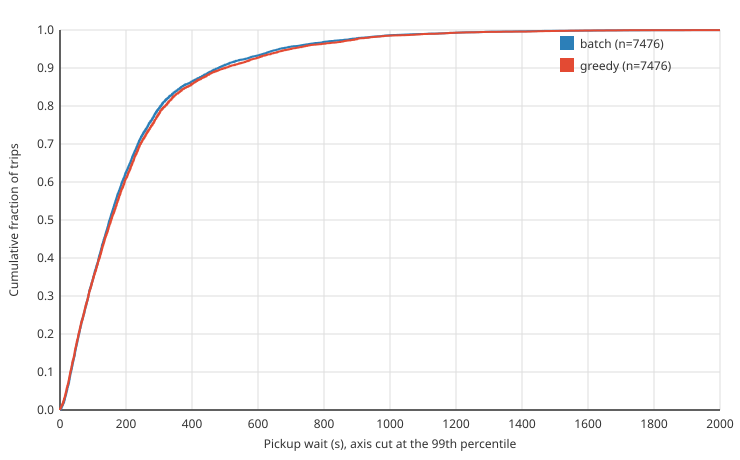
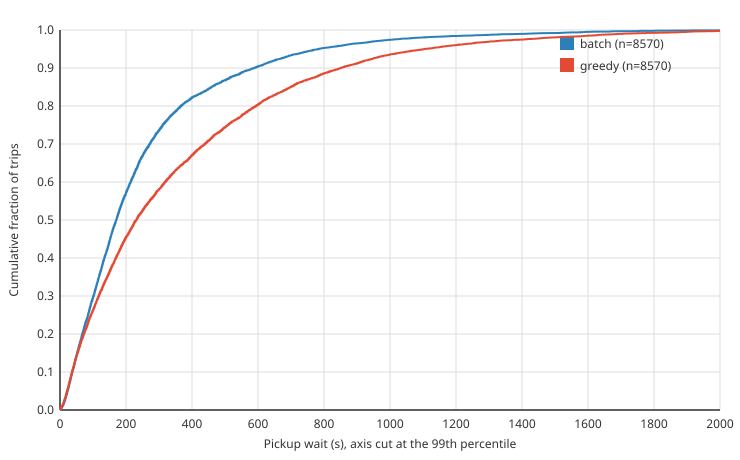

# downtown: greedy vs batch as demand grows

| | |
|---|---|
| graph | `data/osm/city.osm.pbf`, 240128 nodes, 440814 edges |
| scenario | `scenarios/downtown.yaml`, 60 min, 180 vehicles, arrival rates times 1x, 1.25x, 1.5x, 1.75x, 2x |
| seeds | 1 to 10, each run once per policy and demand |
| command | `go run ./cmd/experiment --osm data/osm/city.osm.pbf --scenario scenarios/downtown.yaml --replicates 10 --parallel 8 --demand 1,1.25,1.5,1.75,2` |
| commit | `7d415a5` |

## Mean wait by demand

| demand | requests per run | arrivals per 3 s window | greedy mean wait (s) | batch mean wait (s) | batch minus greedy (s) | 95% CI | batch lower in |
|---:|---:|---:|---:|---:|---:|---:|---:|
| 1x | 426 | 0.35 | 112.5 | 113.8 | +1.3 | [+1.1, +1.6] | 0 of 10 |
| 1.25x | 529 | 0.44 | 134.0 | 134.8 | +0.8 | [+0.1, +1.4] | 3 of 10 |
| 1.5x | 639 | 0.53 | 168.6 | 168.6 | -0.0 | [-2.3, +2.2] | 4 of 10 |
| 1.75x | 748 | 0.62 | 220.0 | 215.9 | -4.0 | [-7.8, -0.3] | 7 of 10 |
| 2x | 857 | 0.71 | 358.3 | 258.2 | -98.6 | [-137.4, -59.3] | 9 of 10 |

Differences are per seed, paired, with a 95% bootstrap interval across seeds. The sections below have each level in full.

## 1x demand

### All trips

| policy | requested | picked up | completed | mean wait (s) | p50 (s) | p95 (s) |
|---|---:|---:|---:|---:|---:|---:|
| greedy | 4259 | 4259 (100.0%) | 4239 | 112.5 | 77.4 | 303.2 |
| batch | 4259 | 4259 (100.0%) | 4238 | 113.8 | 78.7 | 305.1 |

Waits cover every rider who asked for a ride, including riders still aboard when the run stopped. A rider never picked up counts with the time they had waited by then, which understates their wait.

### batch vs greedy: mean wait per seed (s)

| seed | greedy | batch | difference |
|---:|---:|---:|---:|
| 1 | 111.6 | 112.7 | +1.1 |
| 2 | 116.3 | 117.3 | +1.0 |
| 3 | 123.2 | 124.4 | +1.2 |
| 4 | 135.6 | 137.2 | +1.6 |
| 5 | 118.6 | 120.6 | +2.0 |
| 6 | 100.2 | 102.0 | +1.8 |
| 7 | 101.5 | 102.3 | +0.8 |
| 8 | 110.9 | 112.0 | +1.2 |
| 9 | 109.1 | 110.5 | +1.4 |
| 10 | 99.2 | 100.3 | +1.1 |

Mean difference, batch minus greedy: +1.3 s, 95% bootstrap CI [+1.1, +1.6] across seeds.

batch had the lower mean wait in 0 of 10 seeds; two-sided sign test p = 0.00195.

### Wait-time CDF, all trips

## 1.25x demand

### All trips

| policy | requested | picked up | completed | mean wait (s) | p50 (s) | p95 (s) |
|---|---:|---:|---:|---:|---:|---:|
| greedy | 5288 | 5288 (100.0%) | 5258 | 134.0 | 98.2 | 359.4 |
| batch | 5288 | 5288 (100.0%) | 5258 | 134.8 | 98.4 | 360.7 |

Waits cover every rider who asked for a ride, including riders still aboard when the run stopped. A rider never picked up counts with the time they had waited by then, which understates their wait.

### batch vs greedy: mean wait per seed (s)

| seed | greedy | batch | difference |
|---:|---:|---:|---:|
| 1 | 131.9 | 133.4 | +1.6 |
| 2 | 132.2 | 132.9 | +0.7 |
| 3 | 140.3 | 142.9 | +2.5 |
| 4 | 159.2 | 158.7 | -0.4 |
| 5 | 131.0 | 132.6 | +1.6 |
| 6 | 121.0 | 120.9 | -0.1 |
| 7 | 131.6 | 132.5 | +0.9 |
| 8 | 138.6 | 140.2 | +1.6 |
| 9 | 128.3 | 127.0 | -1.3 |
| 10 | 126.7 | 127.4 | +0.7 |

Mean difference, batch minus greedy: +0.8 s, 95% bootstrap CI [+0.1, +1.4] across seeds.

batch had the lower mean wait in 3 of 10 seeds; two-sided sign test p = 0.344.

### Wait-time CDF, all trips

## 1.5x demand

### All trips

| policy | requested | picked up | completed | mean wait (s) | p50 (s) | p95 (s) |
|---|---:|---:|---:|---:|---:|---:|
| greedy | 6387 | 6387 (100.0%) | 6341 | 168.6 | 125.5 | 509.6 |
| batch | 6387 | 6387 (100.0%) | 6344 | 168.6 | 125.7 | 507.3 |

Waits cover every rider who asked for a ride, including riders still aboard when the run stopped. A rider never picked up counts with the time they had waited by then, which understates their wait.

### batch vs greedy: mean wait per seed (s)

| seed | greedy | batch | difference |
|---:|---:|---:|---:|
| 1 | 155.1 | 159.1 | +4.0 |
| 2 | 148.1 | 146.5 | -1.6 |
| 3 | 185.9 | 186.7 | +0.8 |
| 4 | 217.2 | 210.5 | -6.7 |
| 5 | 170.9 | 166.8 | -4.0 |
| 6 | 157.5 | 163.7 | +6.2 |
| 7 | 177.6 | 174.6 | -3.0 |
| 8 | 160.4 | 160.6 | +0.2 |
| 9 | 147.2 | 147.9 | +0.6 |
| 10 | 161.6 | 164.7 | +3.2 |

Mean difference, batch minus greedy: -0.0 s, 95% bootstrap CI [-2.3, +2.2] across seeds.

batch had the lower mean wait in 4 of 10 seeds; two-sided sign test p = 0.754.

### Wait-time CDF, all trips

## 1.75x demand

### All trips

| policy | requested | picked up | completed | mean wait (s) | p50 (s) | p95 (s) |
|---|---:|---:|---:|---:|---:|---:|
| greedy | 7476 | 7474 (100.0%) | 7405 | 220.0 | 153.7 | 690.3 |
| batch | 7476 | 7474 (100.0%) | 7415 | 215.9 | 150.9 | 675.4 |

Waits cover every rider who asked for a ride, including riders still aboard when the run stopped. A rider never picked up counts with the time they had waited by then, which understates their wait.

### batch vs greedy: mean wait per seed (s)

| seed | greedy | batch | difference |
|---:|---:|---:|---:|
| 1 | 211.7 | 215.4 | +3.6 |
| 2 | 179.9 | 182.4 | +2.5 |
| 3 | 257.2 | 244.7 | -12.5 |
| 4 | 262.3 | 247.5 | -14.7 |
| 5 | 220.4 | 215.4 | -5.0 |
| 6 | 233.4 | 230.1 | -3.3 |
| 7 | 209.8 | 206.6 | -3.2 |
| 8 | 202.5 | 201.8 | -0.8 |
| 9 | 179.3 | 182.0 | +2.7 |
| 10 | 237.1 | 228.0 | -9.1 |

Mean difference, batch minus greedy: -4.0 s, 95% bootstrap CI [-7.8, -0.3] across seeds.

batch had the lower mean wait in 7 of 10 seeds; two-sided sign test p = 0.344.

### Wait-time CDF, all trips

## 2x demand

### All trips

| policy | requested | picked up | completed | mean wait (s) | p50 (s) | p95 (s) |
|---|---:|---:|---:|---:|---:|---:|
| greedy | 8570 | 8553 (99.8%) | 8383 | 358.3 | 232.5 | 1100.5 |
| batch | 8570 | 8563 (99.9%) | 8466 | 258.2 | 171.4 | 800.5 |

Waits cover every rider who asked for a ride, including riders still aboard when the run stopped. A rider never picked up counts with the time they had waited by then, which understates their wait.

### batch vs greedy: mean wait per seed (s)

| seed | greedy | batch | difference |
|---:|---:|---:|---:|
| 1 | 375.3 | 247.0 | -128.3 |
| 2 | 291.9 | 238.2 | -53.7 |
| 3 | 449.8 | 289.6 | -160.2 |
| 4 | 517.5 | 302.1 | -215.3 |
| 5 | 385.8 | 267.9 | -117.9 |
| 6 | 331.1 | 244.8 | -86.3 |
| 7 | 347.1 | 253.4 | -93.7 |
| 8 | 239.4 | 244.4 | +5.0 |
| 9 | 241.6 | 239.4 | -2.2 |
| 10 | 384.7 | 251.6 | -133.1 |

Mean difference, batch minus greedy: -98.6 s, 95% bootstrap CI [-137.4, -59.3] across seeds.

batch had the lower mean wait in 9 of 10 seeds; two-sided sign test p = 0.0215.

### Wait-time CDF, all trips

