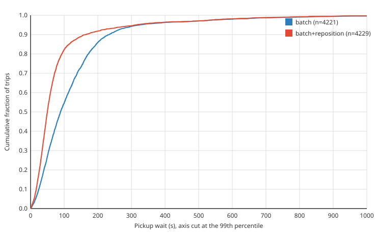

# downtown: batch vs batch+reposition

| | |
|---|---|
| graph | `data/osm/city.osm.pbf`, 240128 nodes, 440814 edges |
| scenario | `scenarios/downtown.yaml`, 60 min, 180 vehicles |
| seeds | 1 to 10, each run once per policy |
| command | `go run ./cmd/experiment --osm data/osm/city.osm.pbf --scenario scenarios/downtown.yaml --replicates 10 --policies batch,batch+reposition` |
| commit | `feeaba2` |

## All trips

| policy | requested | picked up | completed | mean wait (s) | p50 (s) | p95 (s) |
|---|---:|---:|---:|---:|---:|---:|
| batch | 4259 | 4259 (100.0%) | 4219 | 133.5 | 92.4 | 368.8 |
| batch+reposition | 4259 | 4259 (100.0%) | 4224 | 94.0 | 51.5 | 342.4 |

Waits cover every rider who was picked up, including riders still aboard when the run stopped.

batch+reposition made 5815 repositioning moves, 582 per run.

## batch+reposition vs batch: mean wait per seed (s)

| seed | batch | batch+reposition | difference |
|---:|---:|---:|---:|
| 1 | 132.2 | 99.2 | -33.0 |
| 2 | 137.1 | 104.3 | -32.7 |
| 3 | 143.4 | 104.0 | -39.4 |
| 4 | 158.5 | 120.0 | -38.5 |
| 5 | 139.2 | 99.8 | -39.4 |
| 6 | 119.7 | 75.1 | -44.6 |
| 7 | 125.7 | 81.4 | -44.4 |
| 8 | 132.1 | 89.5 | -42.6 |
| 9 | 129.6 | 90.4 | -39.2 |
| 10 | 118.4 | 76.9 | -41.5 |

Mean difference, batch+reposition minus batch: -39.5 s, 95% bootstrap CI [-41.9, -36.9] across seeds.

batch+reposition had the lower mean wait in 10 of 10 seeds; two-sided sign test p = 0.00195.

## Wait-time CDF, all trips

